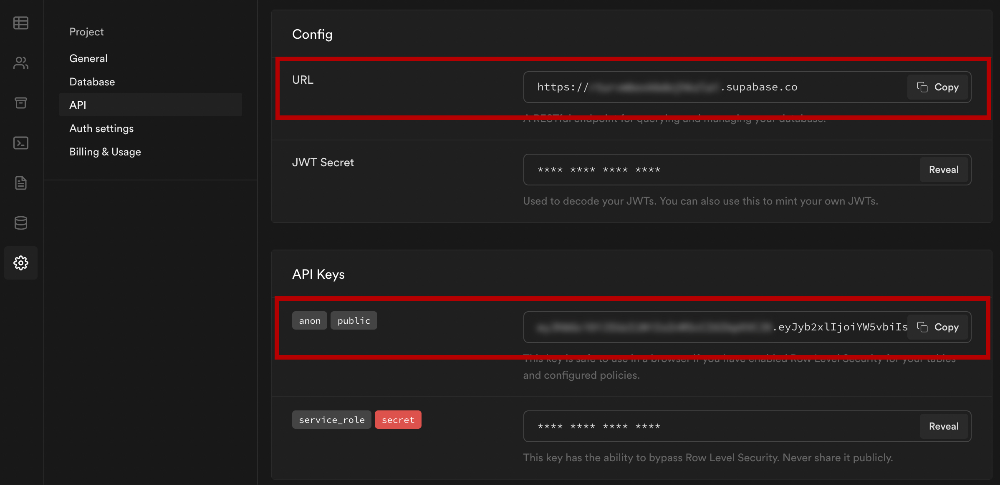

# Building a Multi-User Blogging App with Nuxt and Supabase

By Nader Dabit https://css-tricks.com/author/dabit/

Aug 19, 2021

https://css-tricks.com/using-nuxt-and-supabase-for-a-multi-user-blogging-app/

https://github.com/dabit3/nuxt-supabase-full-multi-user-blog

This project goes along with the blog post featured on CSS Tricks.

### Running the project

To get started with this project, follow these steps.

1. Create a new project in the Supabase dashboard

2. Click on SQL in the left menu, and execute the following SQL query:

```sql
CREATE TABLE posts (
  id bigint generated by default as identity primary key,
  user_id uuid references auth.users not null,
  user_email text,
  title text,
  content text,
  inserted_at timestamp with time zone default timezone('utc'::text, now()) not null
);

alter table posts enable row level security;

create policy "Individuals can create posts." on posts for
    insert with check (auth.uid() = user_id);

create policy "Individuals can update their own posts." on posts for
    update using (auth.uid() = user_id);

create policy "Individuals can delete their own posts." on posts for
    delete using (auth.uid() = user_id);

create policy "Posts are public." on posts for
    select using ( true );
```

3. Clone the project

```sh
git clone git@github.com:dabit3/nuxt-supabase-full-multi-user-blog.git
```

4. Change into the new directory and install the dependencies

```sh
cd nuxt-supabase-full-multi-user-blog

npm install
```

5. Create a file called `.env` that includes the following variables:

https://nuxtjs.org/docs/configuration-glossary/configuration-env/

```java
# .env

NUXT_ENV_SUPABASE_PROJECT_URL=<SUPABASE_PROJECT_URL>'
NUXT_ENV_SUPBASE_ANON_API_KEY='<SUPBASE_ANON_API_KEY>'
```

We need to replace the values with a project ID and API token. Both of these can be retrieved from your Supabase project dashboard.

6. Update __plugins/client.js__ with the values from your Supabase project:

```javascript
import { createClient } from '@supabase/supabase-js'

const NUXT_ENV_SUPABASE_PROJECT_URL = process.env.NUXT_ENV_SUPABASE_PROJECT_URL;
const NUXT_ENV_SUPBASE_ANON_API_KEY = process.env.NUXT_ENV_SUPBASE_ANON_API_KEY;

// console.log(process.env.NUXT_ENV_SUPABASE_PROJECT_URL);
// console.log(process.env.NUXT_ENV_SUPBASE_ANON_API_KEY);

const supabase = createClient(
  NUXT_ENV_SUPABASE_PROJECT_URL,
  NUXT_ENV_SUPBASE_ANON_API_KEY
  )

export default (_, inject) => {
  inject('supabase', supabase)
}
```



7. Run the server

```sh
npm run dev
```